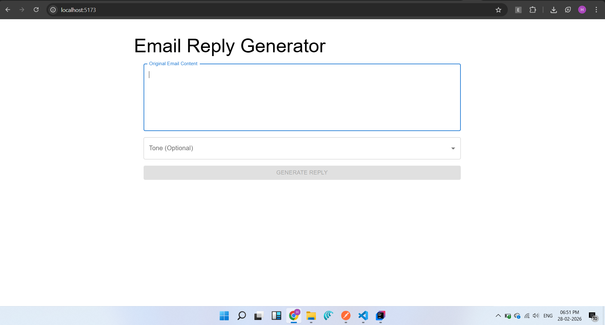
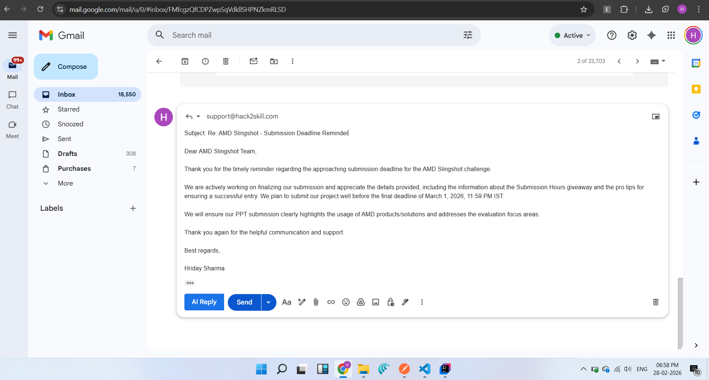
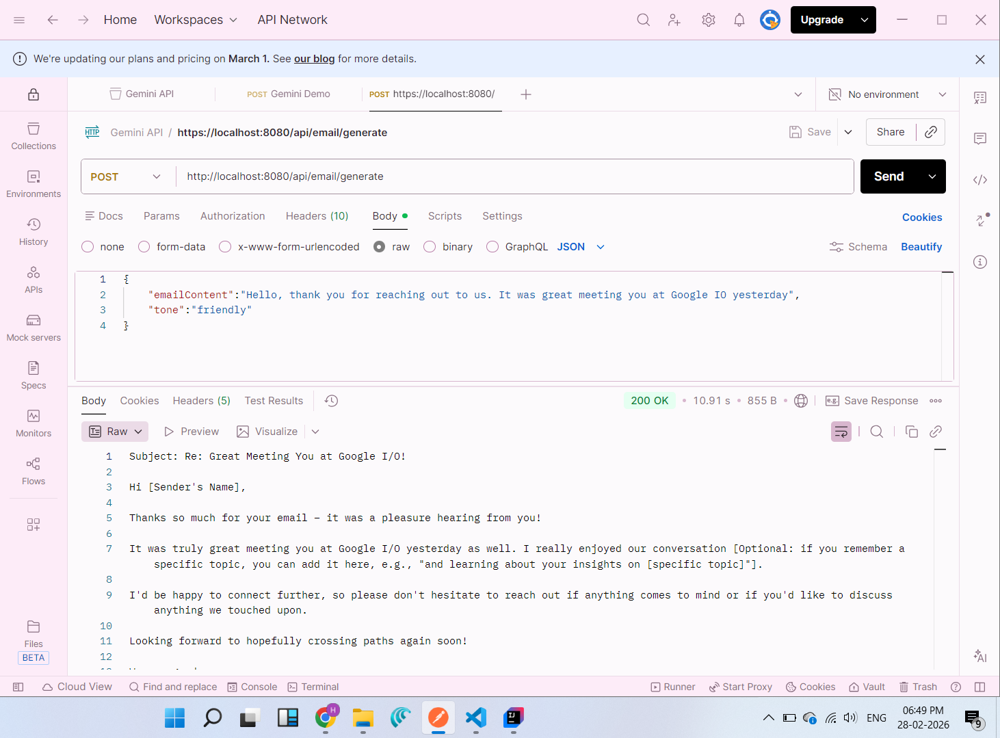

# SmartMail Automation Platform

An AI-powered tool that generates context-aware email replies. It includes a Spring Boot backend, a React frontend, and a Google Chrome Extension.

## 🚀 Features

- **AI Email Generation:** Generates professional replies based on the original email content.
- **Tone Selection:** Customize the response tone (e.g., friendly, professional, concise).
- **Multi-Client Support:** Use via the web interface or directly within Gmail using the Chrome Extension.

## 🛠️ Tech Stack

- **Backend:** Java, Spring Boot, Spring WebFlux (WebClient), REST APIs.
- **Frontend:** React (Vite), Material UI (MUI), Axios.
- **Browser Extension:** Manifest V3, JavaScript, Chrome Extensions API.

## 📁 Project Structure

- `email-writer-sb/`: Spring Boot backend application.
- `email-writer-frontend/`: React-based web interface.
- `email-writer-ext/`: Chrome extension for Gmail integration.

## 📸 Screenshots

**Web Interface**

**Chrome Extension in Gmail**

**Postman API Testing**

## ⚙️ Setup Instructions

### Backend (Spring Boot)

1. Navigate to `email-writer-sb`.
2. Open in IntelliJ IDEA or your preferred IDE.
3. Run `EmailWriterSbApplication.java`.
4. The server starts on `http://localhost:8080`.

### Frontend (React)

1. Navigate to `email-writer-frontend`.
2. Run `npm install`.
3. Run `npm run dev`.
4. Access the UI at `http://localhost:5173`.

### Chrome Extension

1. Open Chrome and go to `chrome://extensions/`.
2. Enable **Developer mode** (top right).
3. Click **Load unpacked**.
4. Select the `email-writer-ext` folder.